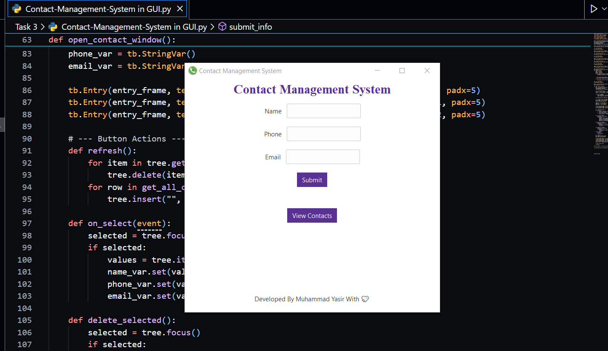

# PRODIGYINFOTECH-SD-03
The Contact Management System is a desktop GUI application developed using Python, Tkinter with ttkbootstrap, and MySQL as the backend database. This system allows users to efficiently store, manage, and update contact information in a modern, user-friendly interface. 
# 📇 Prodigy InfoTech Internship - Task 03

## 📁 Contact Management System (GUI Desktop App)

### 📌 Objective:
Develop a GUI-based **Contact Management System** using **Python**, **Tkinter with ttkbootstrap**, and **MySQL** to perform real-time contact CRUD operations (Create, Read, Update, Delete) in a user-friendly interface.

---

### 🧠 Description:
The **Contact Management System** is a modern desktop application that allows users to manage their personal or professional contacts easily. It supports:
- Adding new contacts
- Editing and updating existing contact details
- Deleting unwanted contacts
- Searching/filtering through the list

All contact data is stored securely in a **MySQL database**, ensuring persistence and structured data storage. The GUI is built using `ttkbootstrap` for a clean, responsive, and attractive layout.

---

### 🚀 Features:
- 📥 Add new contacts with name, phone, and email
- 📝 Update contact information
- ❌ Delete selected contacts
- 🔍 Search by name or phone number
- 📦 Backend connected to a **MySQL** database
- 🎨 Beautiful, themed interface using **ttkbootstrap**

---

### 🛠️ Technologies Used:
- Python 3.x
- `tkinter for GUI
- `ttkbootstrap for modern UI design
- `mysql-connector-python for database connectivity
- MySQL Server

---

### ▶️ How to Run:

1. **Install required libraries**:
   `bash
   pip install ttkbootstrap mysql-connector-python
### 🖼️ Screenshot:

### 🖼️ Screenshot:
[.PNG)](task-03(2).PNG)

---

### ✍️ Author:
- **Name**: Muhammad Yasir
- **Internship Program**: Prodigy InfoTech – Python Programming
- **Task**: 03 – Contact Management System  (GUI with ttkbootstrap)
- **📧 Email**: [yaisikhan111@@gmail.com](mailto:yaisikhan111@gmail.com)

🧑‍💻 How It Works:
GUI loads with a form and contact list.

User can add new contact using the input fields.

All contacts are displayed in a table.

Selecting a contact enables Edit/Delete actions.

All changes are reflected in the MySQL database.

📌 Note:
This project is developed as part of the Prodigy InfoTech Virtual Internship Program to demonstrate real-world Python GUI development and database integration skills.

🌟 Optional Enhancements:
🔐 Add login/authentication system

☁️ Use SQLite for lightweight local storage

📊 Export contact list to CSV or Excel
